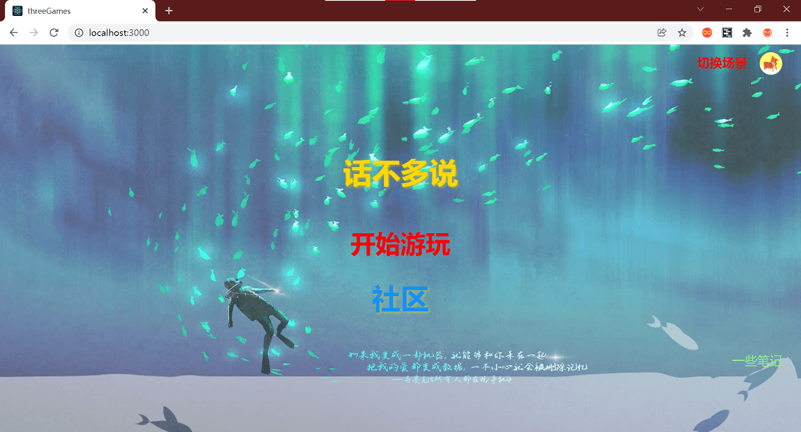

# threeGames

## start

`npm start`

## 项目结构

- public：存放 index.html 和各种静态资源
- src：项目主要内容
	- index.js：整个项目的入口
	- config.js：项目的一些配置
	- utils.js: 项目每次加载都运行的代码，和一些导出函数
	- App：管理整个项目
	- Auth：用户
	- Community：社区
	- components：一些可复用组件
	- hook：自定义 hook
	- MineSweep：扫雷
	- Note：笔记
	- TanksWar：坦克大战
	- Tetris：俄罗斯方块

## 部分内容展示

- 主页

	

- 俄罗斯方块

	

- 扫雷

	

- 坦克大战

	

- 社区

	

- 笔记

	
